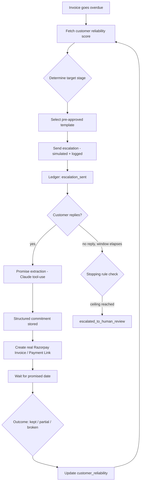

# CHASR — Technical Architecture

**B2B Invoice Recovery Agent · Razorpay AI Buildathon · Track 3, AI Revenue Recovery**

## 1. What this is, in one line

An agent that watches overdue B2B invoices, escalates through compliant pre-approved templates, extracts structured promises from customer replies, scores customer reliability from real history, and proves recovered amount + honest exceptions on a held-out batch — with every step in a tamper-evident ledger.

## 2. MVP scope — what's in, what's explicitly out

**In scope:**
- All four engines running end-to-end against a synthetic dataset
- Real Razorpay test-mode Invoice / Payment Link creation via the MCP server or REST
- A hash-chained audit ledger with a live "verify integrity" check
- A batch evaluation run reporting recovered amount, precision/recall, and an honest exception list, compared against a dumb baseline
- Four frontend screens, nothing more

**Explicitly out of scope (say so plainly, don't hide it):**
- Real WhatsApp/SMS delivery — simulated and logged (see §10 for why)
- Voice/call-based collection
- Actual legal escalation — the system flags for human/legal review, it never acts on that flag itself
- Multi-tenant auth, multi-currency, production-grade deployment concerns

## 3. Core features — the four engines

**Escalation engine** — a deterministic, rules-based ladder (nudge → firm → formal). Decides *when* to move a customer to the next stage based on days overdue and their reliability score, and picks from a small set of pre-written, pre-approved templates. Never generates outreach text on the fly — that's the direct answer if anyone asks "why isn't this AI."

**Promise extraction** — the one place an LLM does real product work. Reads a customer's actual reply and pulls out a structured commitment: amount, promised date, how firm it sounds. A single reply can produce more than one commitment (e.g. "50% Thursday, rest by month-end").

**Reliability scoring** — classic ML, not an LLM. A simple, explainable classifier trained on each customer's own promise-keeping history, producing one number: the probability this customer follows through. That number sets both how much patience they get and what kind of intervention fits.

**Audit ledger** — an append-only, hash-chained record of every status change, message, and promise. The single source of truth the other tables are just convenient views over.

## 4. Tech stack

| Layer | Choice | Why |
|---|---|---|
| Backend | Python + FastAPI | Familiar stack, low ceremony, fast to iterate under a deadline |
| Database | SQLite | Zero setup, file-based, easy to inspect mid-build — not a real bottleneck at this scale |
| ORM | SQLAlchemy, or raw `sqlite3` | Either is fine — pick whichever produces cleaner code for you |
| Structured extraction | Anthropic API, forced tool-use | Matches the underlying pattern Razorpay's own agents run on (Claude Agent SDK) — worth stating explicitly in the pitch |
| Reliability model | scikit-learn `LogisticRegression` | Deliberately simple and explainable — precision/recall on a linear model is easy to defend live, and explainability itself is part of "the bar" |
| Real payment integration | Razorpay MCP server (`mcp.razorpay.com`) or direct REST — Invoices API + Payment Links | This is the "touched the real thing" proof |
| Frontend | React + Vite | Fast to build, matches prior experience |

## 5. System flow



Everything on this diagram writes to the ledger. The ledger is the spine; every other table is a queryable projection of it.

## 6. Data model (SQLite)

```sql
customers (
  id, name, gstin, phone, email, created_at
)

invoices (
  id, customer_id FK, amount, due_date, issued_date,
  razorpay_invoice_id,          -- link to the real Razorpay Invoice object
  status        ENUM(unpaid, partially_paid, paid, written_off),
  current_stage ENUM(none, nudge, firm, formal),
  last_contacted_at
)

ledger (                        -- the audit trail, append-only, never UPDATE/DELETE
  id, invoice_id FK,
  event_type ENUM(
    invoice_created, escalation_sent, reply_received,
    promise_extracted, promise_status_updated,
    payment_link_created, payment_received,
    escalated_to_human_review
  ),
  payload JSON,
  created_at,
  prev_hash, hash              -- sha256(prev_hash + json(entry)), chained
)

promises (
  id, invoice_id FK, ledger_entry_id FK,
  amount, promised_date,
  confidence ENUM(firm, soft, vague),
  status     ENUM(pending, kept_full, kept_partial, broken),
  source_text
)

customer_reliability (
  customer_id FK, computed_at,
  total_promises, kept_full, kept_partial, broken,
  kept_full_rate FLOAT,         -- kept_full / total_promises
  broken_rate FLOAT,            -- broken / total_promises
  avg_days_late, score FLOAT    -- model output, 0 to 1
)
```

Ratio fields (`kept_full_rate`, `broken_rate`) sit alongside the raw counts on purpose — see §9 for why.

## 7. Component-by-component build guide

### `backend/main.py`
- **Do:** wire up FastAPI routes and DB session dependency injection only
- **Don't:** put any decision logic here — routes call into `engines/`, they never decide anything themselves

### `backend/models.py`
- **Do:** SQLAlchemy models mirroring the schema in §6 exactly
- **Don't:** store a "score" as if it's permanent data — it's always recomputed via the reliability engine, never hand-edited

### `backend/engines/escalation.py`
- **Do:** keep this fully deterministic and unit-testable with zero API calls
- **Don't:** ever call the LLM from this file — this is what makes the escalation ladder defensible as provable, not "AI vibes"

### `backend/engines/promise_extraction.py`
- **Do:** force structured tool-use output; validate the schema before writing to the DB; handle `has_commitment: false` and null amount/date gracefully
- **Don't:** fall back to regex parsing of free text, and never let the model invent a number or date that wasn't actually stated

### `backend/engines/reliability.py`
- **Do:** compute features live from the `ledger`/`promises` tables at inference time; train the model offline once on the synthetic dataset and load it at startup
- **Don't:** retrain on every request — training is an offline step, scoring at runtime is inference-only

### `backend/engines/ledger.py`
- **Do:** append-only by construction; provide a `verify_chain()` function; periodically commit the ledger's latest hash into the git repo itself as an external, independently-timestamped record
- **Don't:** allow UPDATE or DELETE on ledger rows anywhere in the codebase — enforce this at the application layer at minimum

### `backend/integrations/razorpay_client.py`
- **Do:** keep this the *only* file that talks to Razorpay's API/MCP server; wrap `create_invoice`, `create_payment_link`, `fetch_payment` as clean, small functions
- **Don't:** scatter Razorpay calls across other files — this isolation is exactly what you point to when someone asks "did you actually touch the real API"

### `backend/data/generate_synthetic.py`
- **Do:** implement the five archetypes from §9.1, generating reply tone and actual outcome from **separate** random rolls
- **Don't:** let one roll determine both how confident a reply sounds and whether the promise is kept — that quietly makes the extraction engine look artificially perfect and defeats the entire point of the reliability score

### `frontend/src/pages/*`
- **Do:** stick to exactly four screens (below)
- **Don't:** add a fifth screen for the demo's sake — this is the easiest place to over-build something that doesn't earn its place

## 8. Frontend — four screens, nothing else

- **`/dashboard`** — invoice list: status, days overdue, reliability score, next scheduled action
- **`/invoice/:id`** — full ledger timeline for that invoice, extracted promises, a "verify integrity" button
- **`/simulate`** — paste a customer reply, watch extraction happen live — the best demo moment
- **`/results`** — batch run: recovered amount, precision/recall, honest exception list, side-by-side against the dumb baseline

## 9. Six decisions that had to be nailed down before writing any code

### 9.1 Customer behavior simulator

Every synthetic customer gets hidden persona parameters, invisible to the model and to extraction, used only to generate data:

| Parameter | What it controls |
|---|---|
| `honesty` (0–1) | Probability a stated promise is actually kept |
| `responsiveness` (0–1) | Probability they reply to an escalation at all |
| `typical_delay_days` | If honest but late, how late, typically |

Five archetypes, not a uniform spread:

| Archetype | honesty | responsiveness | style |
|---|---|---|---|
| Reliable | 0.9 | 0.9 | short, confirmatory replies |
| Slow-but-honest | 0.85 | 0.6 | pays late, always genuine |
| Cash-strapped-genuine | 0.55 | 0.7 | real excuses, often partial |
| Serial-slippery | 0.25 | 0.7 | confident, firm-*sounding*, rarely follows through |
| Ghost | 0.4 | 0.2 | mostly silent |

**The one rule that matters most in the whole project:** generate the reply's tone and the actual outcome from separate rolls, correlated by archetype but never identical. A serial-slippery customer should sometimes write a firm, confident promise and still break it. If tone always matched outcome, there'd be nothing for the reliability score to add over just reading the message — and that's the entire reason this system exists instead of a human just trusting how confident someone sounds.

Use an LLM only to generate *variety* in reply phrasing per archetype — that's test-data generation, not product logic.

Scale: ~50 customers across the five archetypes, 5–10 invoices each over a simulated 6–12 month history.

### 9.2 Train/test split — by customer, not by invoice

```python
customer_ids = list(all_customers)
random.shuffle(customer_ids)
train_ids, test_ids = customer_ids[:35], customer_ids[35:]   # ~70/30 split
```

Splitting by invoice lets some of a customer's invoices leak into training while others land in test — the model ends up partly evaluated on customers it already knows, inflating precision/recall dishonestly. Split the customer list first, always.

### 9.3 Kept / partial / broken — the label definition

Given `D` = promised date:

- **KEPT** — ≥95% of promised amount received by `D + 2` days
- **PARTIAL** — 30–95% of promised amount received by `D + 7` days
- **BROKEN** — <30% received by `D + 7` days

Adjust the numbers if they don't fit your data, but fix them *before* generating data — every downstream metric depends on this being decided up front, not after looking at results.

### 9.4 Stopping rule

- After the formal-notice stage: a fixed **10-day observation window**. Any reply or payment during it keeps the invoice active.
- No response and no payment by the end of the window → `status = escalation_exhausted`, automated contact stops, ledger entry `escalated_to_human_review`.
- **Independent hard ceiling regardless of stage:** max 6 total automated contacts on any single invoice — protects against your own sender account getting flagged for excessive messaging, not just against annoying the customer.

### 9.5 Baseline

Run a second, deliberately dumb agent on the *identical* synthetic batch: fixed-interval reminder every 5 days, same generic message for everyone, no reliability weighting, no promise tracking. Report both totals side by side — recovered amount and average days-to-recovery. "We recovered 23% more than a fixed-schedule reminder on the same 50 invoices" is a real, defensible result; "we recovered ₹4.2 lakh" alone is not. This is also the cleanest answer if a panelist asks "isn't this just reminders?"

### 9.6 The scripted failure for the demo video

Use a cash-strapped-genuine customer with a deliberately vague reply:

> "Hi, we're sorting a few things out on our end, should be able to close this out soonish — will keep you posted."

Expected behavior: extraction returns `has_commitment: true` with `amount: null`, `date: null`, `confidence: "vague"` — it does **not** invent a number or date it wasn't given. The invoice gets flagged `needs_review`, automated escalation pauses, and it surfaces on the dashboard under a "Needs Review" filter. That's the failure handled gracefully — recognizing the limit of what it can confidently extract, instead of guessing. Write this exact exchange into the test data now so it's guaranteed to appear in the recorded batch.

## 10. What's simulated vs. real — say this out loud in the pitch

- **Real:** Razorpay Invoice/Payment Link creation via the actual API or MCP server, the ledger hash chain (with its latest hash committed to the git repo as an external check), the reliability model trained and tested on the synthetic data, the extraction calls to Claude.
- **Simulated, stated plainly, not hidden:** actual WhatsApp/SMS delivery. Both TRAI DLT and Meta WhatsApp Business verification require a real, registered business entity (GST/PAN/company registration) to even begin — a hackathon prototype built by a student doesn't have one. Log escalations as sent and show the exact template that would go out.

## 11. API rules

**Razorpay:** test mode only. The hosted MCP server (`mcp.razorpay.com`) restricts some tools (refunds, settlements) — this project only needs Invoices and Payment Links, so the hosted version is sufficient; the self-hosted Docker version is only needed if that changes. Your own frequency caps (§9.4) are enforced in your own application logic, independent of any Razorpay-side rate limit.

**Anthropic API:** forced tool-use only for promise extraction — never let the model free-write the outbound message text, that stays template-based and deterministic (§7, `escalation.py`). Low or zero temperature for extraction, since consistency matters more than creativity here.

## 12. Folder structure — CHASR

```
chasr/
├── README.md
├── .env.example                       # RAZORPAY_KEY_ID, RAZORPAY_KEY_SECRET, ANTHROPIC_API_KEY, etc. — never commit the real .env
├── .gitignore                         # .env, *.db, model.pkl if you regenerate it, __pycache__, node_modules
│
├── backend/
│   ├── main.py                        # FastAPI app + router registration only — no decision logic here (§7)
│   ├── config.py                      # env vars, and the fixed constants from §9.3/§9.4 (thresholds, contact ceiling) — one place, not scattered
│   ├── database.py                    # SQLAlchemy engine + session dependency
│   ├── models.py                      # customers, invoices, ledger, promises, customer_reliability (§6)
│   ├── schemas.py                     # Pydantic request/response models for the routers
│   │
│   ├── engines/
│   │   ├── __init__.py
│   │   ├── escalation.py              # deterministic ladder + template selection — zero API calls (§7)
│   │   ├── promise_extraction.py      # Claude forced tool-use — never a regex fallback (§7)
│   │   ├── reliability.py             # feature computation + inference only; loads the trained model (§7)
│   │   └── ledger.py                  # append-only hash chain + verify_chain() (§7, §14)
│   │
│   ├── integrations/
│   │   ├── __init__.py
│   │   └── razorpay_client.py         # the ONLY file that talks to Razorpay's API/MCP server (§7)
│   │
│   ├── templates/
│   │   └── message_templates.py       # hand-written stage templates (nudge/firm/formal) — never generated on the fly
│   │
│   ├── ml/
│   │   ├── train_reliability_model.py # offline training script, customer-level split (§9.2)
│   │   ├── evaluate.py                # precision/recall/ROC-AUC on held-out set + baseline comparison (§9.5)
│   │   └── model.pkl                  # trained artifact — commit it so the demo doesn't depend on retraining live
│   │
│   ├── data/
│   │   ├── generate_synthetic.py      # 5 archetypes, separate tone/outcome rolls (§9.1) — nothing else runs without this
│   │   └── synthetic.db               # generated dataset used for the batch run and the demo
│   │
│   ├── routers/
│   │   ├── invoices.py                # dashboard + invoice detail endpoints
│   │   ├── simulate.py                # the /simulate live-extraction endpoint
│   │   └── results.py                 # batch run + baseline comparison endpoint
│   │
│   └── tests/
│       ├── test_escalation.py
│       ├── test_ledger.py             # includes a test that verify_chain() actually fails on tampered data
│       └── test_reliability_split.py  # asserts the split is by customer, not by invoice
│
├── frontend/
│   ├── index.html
│   ├── package.json
│   ├── vite.config.js
│   └── src/
│       ├── main.jsx
│       ├── api.js                     # thin fetch wrapper — no business logic in the frontend
│       ├── pages/
│       │   ├── Dashboard.jsx
│       │   ├── InvoiceDetail.jsx
│       │   ├── Simulate.jsx
│       │   └── Results.jsx
│       └── components/
│           ├── ReliabilityBadge.jsx
│           ├── LedgerTimeline.jsx
│           └── VerifyIntegrityButton.jsx
│
└── docs/
    ├── 01_PROBLEM_STATEMENT.md
    ├── 02_MARKET_RESEARCH.md
    ├── 03_TECHNICAL_ARCHITECTURE.md
    └── 04_GLOBAL_ALTERNATIVES.md
```

Two things worth doing on day one, before writing any engine logic: commit `.gitignore` and `.env.example` first so a real secret never accidentally lands in git history, and create `docs/` with all four files immediately — the panel reads the repo, and an empty or missing docs folder on day one looks worse than an unfinished feature later.

## 13. Suggested build order

1. Schema + migrations (§6)
2. Synthetic data generator (§9.1) — nothing else can run without this
3. Reliability engine: offline training script + evaluation on held-out split (§9.2)
4. Ledger engine, including `verify_chain()`
5. Escalation engine (deterministic, no AI)
6. Promise extraction engine (Claude tool-use)
7. Razorpay integration module
8. FastAPI wiring across all engines
9. Frontend — four screens
10. Baseline comparison run + `/results` page
11. Record the scripted failure (§9.6) into the test batch and verify it behaves as expected

## 14. Known limitation to have an answer ready for

The hash chain proves nothing was edited *quietly* after the fact within the chain itself — it does **not** protect against someone with full database access regenerating the entire chain from scratch. The honest answer, and the one actually implemented here: periodically commit the ledger's latest hash into the git repo itself, giving you a second, independently-timestamped record outside the app's own database. If asked live, say this directly rather than being caught without an answer — it's the single most technically askable question in the whole design.
